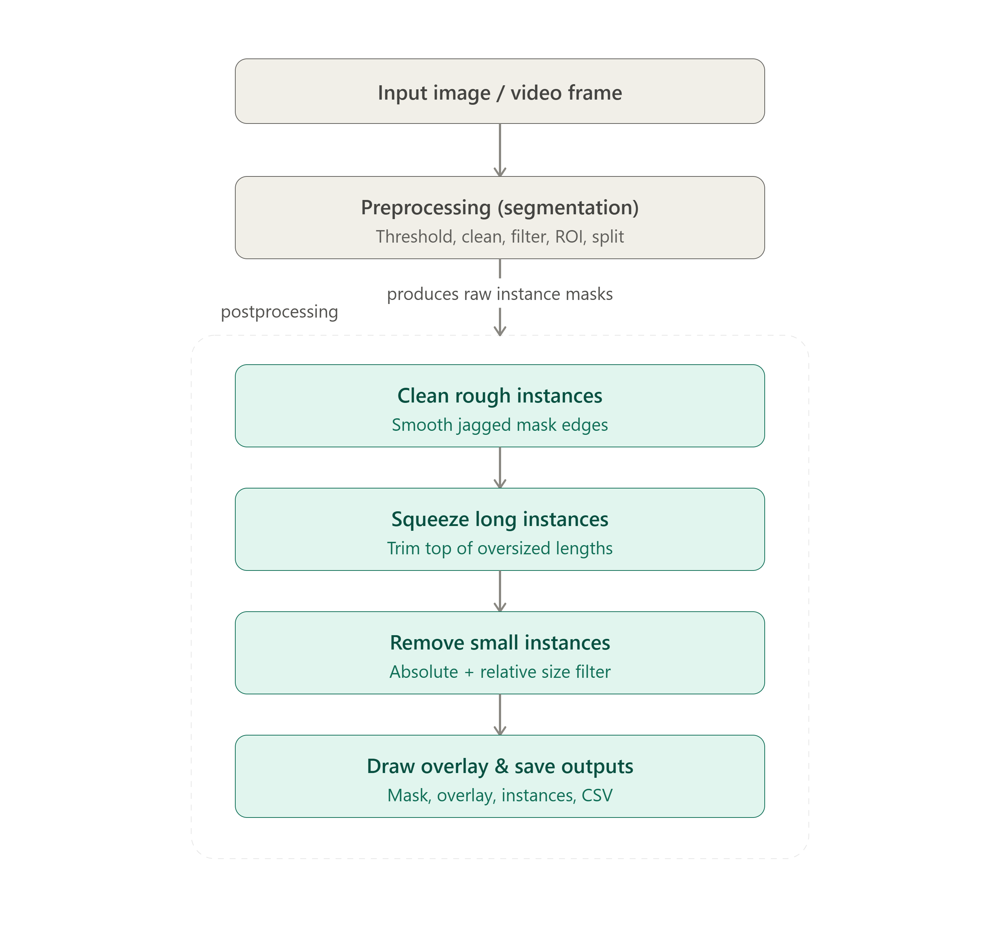

# Baguette Detection Pipeline

Simple CV pipeline to detect, measure, and label baguettes from images/video using OpenCV.

## Demo
> 🔗 Link: *(https://drive.google.com/file/d/1AbCd)*

## WorkFlow
> 

---

## How it works

### 1. Preprocessing
- Convert image to **LAB color space**, use the **L channel** (lightness).
- **Gaussian blur** the L channel to reduce noise.
- **Otsu threshold** → binary mask (auto picks best threshold).
- **Morphological close** (bridges gaps in a baguette's mask, e.g. from steam/reflection breaks).
- **Morphological open** (removes small speckle noise).

### 2. ROI Selection
- `roi_mode = fixed` (default) → use manually set rectangle(s) in `Params.fixed_rois`, no detection needed.
- `roi_mode = auto` → old row-band detection method (kept only for debugging).
- `roi_mode = full` → no ROI restriction, whole frame is valid.
- Any detected blob outside the ROI is dropped.

### 3. Shape Filtering (kills false positives)
Each connected blob is checked against:
- Minimum area / height / width
- Width-to-height ratio (baguettes are tall, not wide)
- Solidity (baguette = smooth capsule shape, not jagged machine parts)
- Angle from vertical (baguettes run vertically in frame; horizontal noise is rejected)

### 4. Postprocessing (after initial detection)
- **Smoothing** — each instance's contour is filled + morph-closed to smooth edges.
- **Splitting merged instances** — if a blob is too wide (likely 2 baguettes touching), use **watershed** to split it.
- **Clean rough instances** — opening + re-filling to clean jagged edges from a bad mask.
- **Length squeeze** — optional step: baguettes measuring 350–425mm get trimmed (from the top only, width untouched) down to 325–349mm. Useful for normalizing oversized detections.
- **Absolute size filter** — reject anything outside real-world mm bounds (independent of frame average).
- **Relative size filter** — only applied once ≥5 instances are found in frame, compares each instance to the frame's average length/width.

### 5. Measurement
- Uses `minAreaRect` on each instance's contour → gives length/width in pixels.
- Converts to mm using `px_per_mm` scale factor.

### 6. Output
For each image:
- `*_mask.png` — final binary mask
- `*_overlay.png` — original image + colored instances + length/width labels + ROI outline
- `*_instances.png` — colored instance mask
- `*_stats.csv` — per-instance stats (position, size, dimensions)

For video: same overlay drawn per-frame + output `.mp4` + optional per-frame PNGs + `video_stats.csv`.

---

## AI / Backend Checklist

Runtime checks for the pipeline — run it and watch what it does. No unit testing required here. This is a CPU-bound classical CV pipeline (Otsu, morphology, contours), so GPU items are N/A unless a GPU path is added later.

- [ ] **CPU RAM leak** — loop the detector over many images; track RSS (`psutil`) and diff `tracemalloc` snapshots. RSS should be flat after warmup.
- [ ] **GPU memory leak** — N/A for the current OpenCV/NumPy-only pipeline.
- [ ] **Soak test** — run over a large image batch, plot the RSS curve. Rising baseline = leak (check masks/overlays not being released between images).
- [ ] **Storage growth over time** — check output dir size at intervals (`du -sh <outdir>`, `df -h`). Watch for overlay/mask PNGs accumulating without cleanup.
- [ ] **Production resolution + batch size** — test at real camera resolution, not a downscaled sample.
- [ ] **CPU usage** — profile hot paths (`py-spy`, `scalene`); morphology + watershed are the likely bottlenecks on large images.
- [ ] **CPU↔GPU boundary** — N/A for the current pure-OpenCV/NumPy pipeline.
- [ ] **Four-bucket profile** — time thresholding / morphology+contours / shape-filter+ROI / postprocessing (smoothing+split+squeeze) separately to find the real bottleneck.